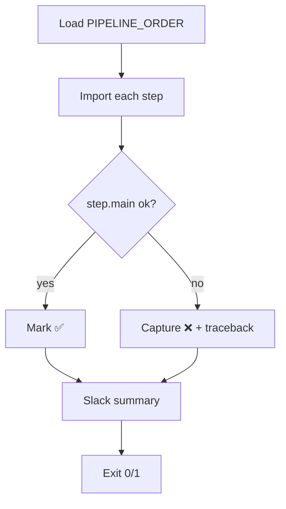

# Auto_Pipeline

## qa_tester 사용법

```bash
export SLACK_WEBHOOK_URL="https://hooks.slack.com/services/..."
python qa_tester.py --config pipeline_config.py
```


```mermaid
flowchart TD
    A[Load PIPELINE_ORDER] --> B[Import each step]
    B --> C{step.main ok?}
    C -- yes --> D[Mark ✅]
    C -- no --> E[Capture ❌ + traceback]
    D & E --> F[Slack summary]
    F --> G[Exit 0/1]
```
