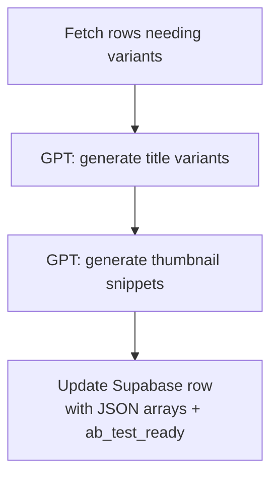

## ab_variant_manager \uc0ac\uc6a9\ubc95

```bash
export SUPABASE_URL="https://xyz.supabase.co"
export SUPABASE_ANON_KEY="public-anon-key"
export OPENAI_API_KEY="sk-..."
python ab_variant_manager.py --table content --limit 5 --title-variants 3 --thumb-variants 2
```


