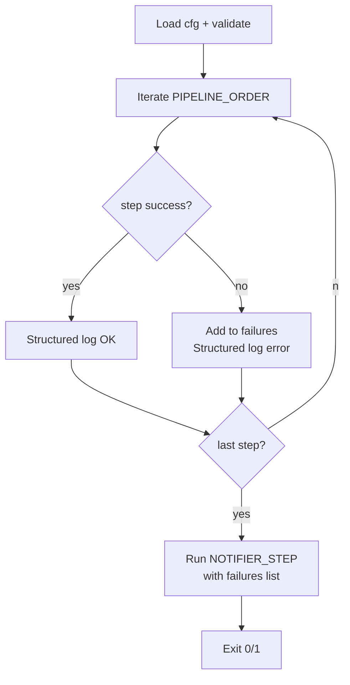

# Auto Pipeline

## run_pipeline 사용법

```bash
python run_pipeline.py --config pipeline_config
```


```mermaid
flowchart TD
    A[Load cfg + validate] --> B[Iterate PIPELINE_ORDER]
    B --> C{step success?}
    C --yes--> D[Structured log OK]
    C --no --> E[Add to failures<br/>Structured log error]
    D & E --> F{last step?}
    F --no--> B
    F --yes--> G[Run NOTIFIER_STEP<br/>with failures list]
    G --> H[Exit 0/1]
```
