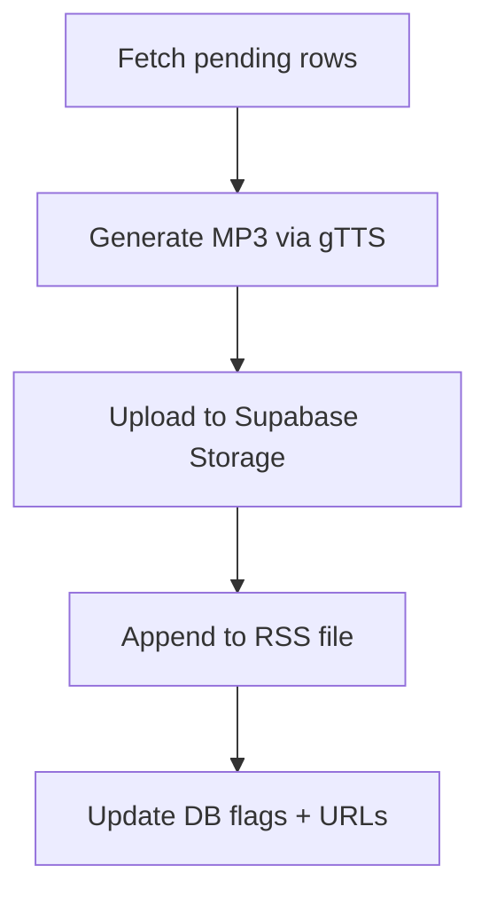

## podcast_creator 사용법

```bash
export SUPABASE_URL="https://xyz.supabase.co"
export SUPABASE_ANON_KEY="public-anon-key"
export PODCAST_RSS_FILE="podcast_feed.xml"
python podcast_creator.py --table content --limit 5
```


