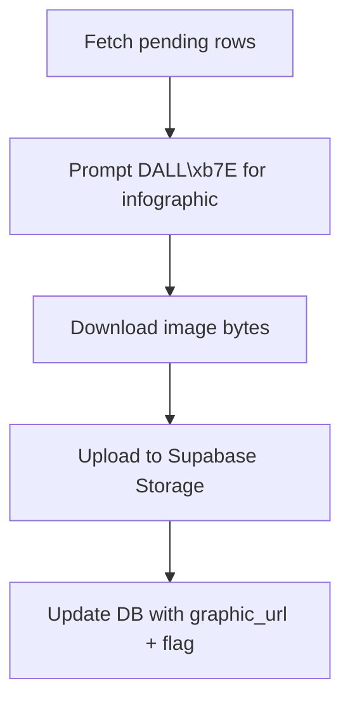

## graphic_generator \uc0ac\uc6a9\ubc95

```bash
export OPENAI_API_KEY="sk-..."
export SUPABASE_URL="https://xyz.supabase.co"
export SUPABASE_ANON_KEY="public-anon-key"
python graphic_generator.py --table content --limit 5
```

Flow

