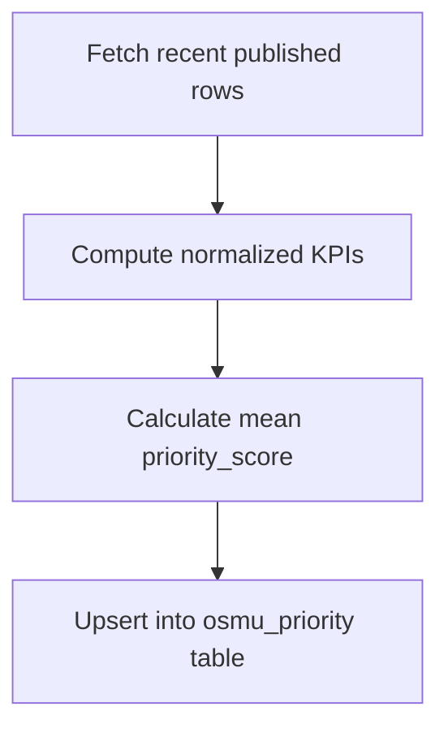

## osmu_analytics 사용법

```bash
export SUPABASE_URL="https://xyz.supabase.co"
export SUPABASE_ANON_KEY="public-anon-key"
python osmu_analytics.py --table content --days 7 --limit 50
```


```mermaid
flowchart TD
    A[Fetch recent published rows] --> B[Compute normalized KPIs]
    B --> C[Calculate mean priority_score]
    C --> D[Upsert into osmu_priority table]
```
