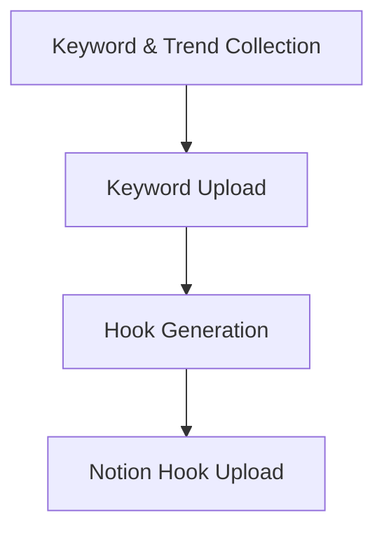
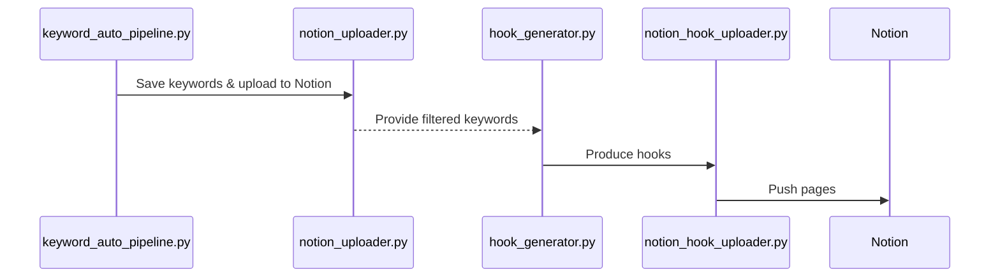

# Auto Pipeline

This repository automates the process of collecting trending keywords, generating marketing hooks with GPT, and pushing everything to Notion. Each step is orchestrated through Python scripts.

## Key Components

- [keyword_auto_pipeline.py](keyword_auto_pipeline.py): gathers keywords from Google Trends and Twitter and stores them in `data/keyword_output_with_cpc.json`.
- [scripts/notion_uploader.py](scripts/notion_uploader.py): uploads filtered keywords to a Notion database.
- [hook_generator.py](hook_generator.py): generates marketing hooks and content drafts using OpenAI based on the collected keywords.
- [notion_hook_uploader.py](notion_hook_uploader.py): uploads generated hooks and drafts to another Notion database.
- [run_pipeline.py](run_pipeline.py): executes the above scripts in sequence.

## Pipeline Overview

## Detailed Sequence

Run `python run_pipeline.py` to execute the full workflow or run individual scripts as needed.

