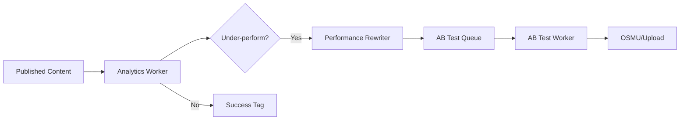

```mermaid
flowchart LR
    A[Published Content] --> B[Analytics Worker]
    B --> C{Under-perform?}
    C -- Yes --> D[Performance Rewriter]
    D --> E[AB Test Queue]
    E --> F[AB Test Worker] --> G[OSMU/Upload]
    B -- No --> H[Success Tag]
```
