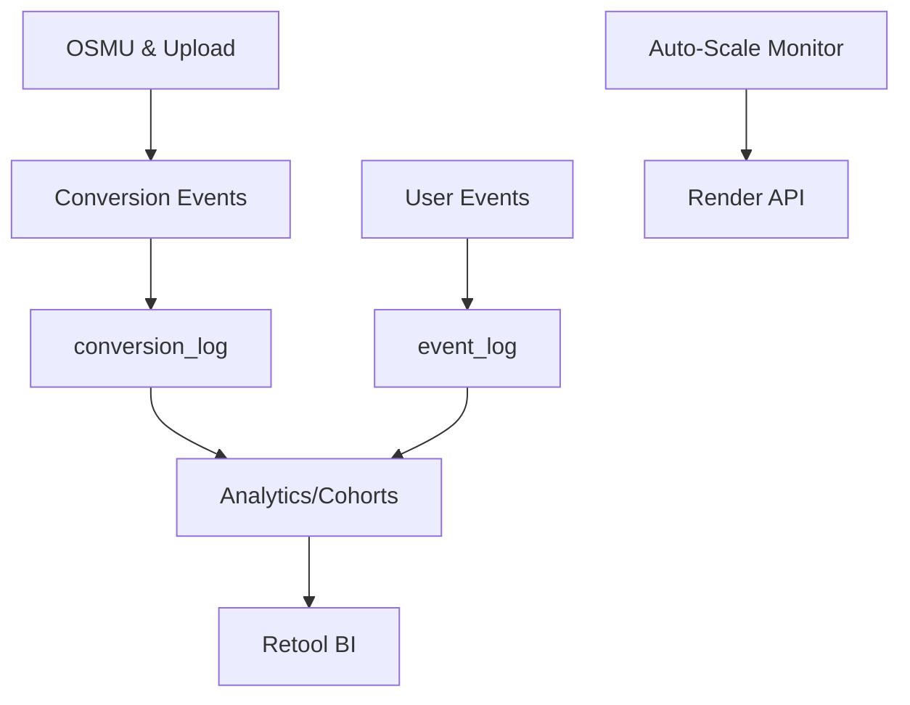

```mermaid
flowchart TD
    A[OSMU & Upload] --> B[Conversion Events]
    B --> C[conversion_log]
    D[User Events] --> E[event_log]
    C & E --> F[Analytics/Cohorts]
    F --> G[Retool BI]
    H[Auto-Scale Monitor] --> I[Render API]
```
